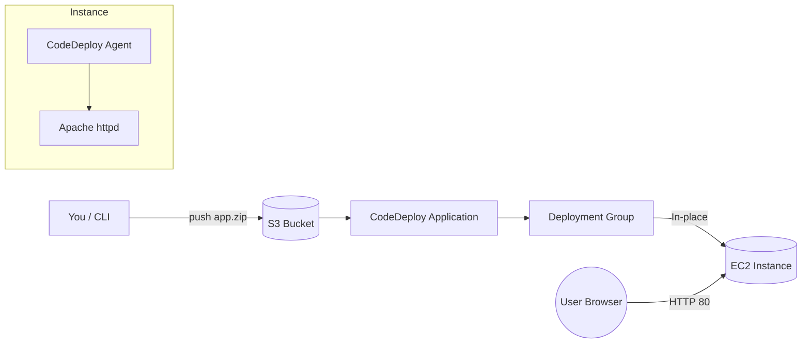

# AWS CodeDeploy on EC2 — End‑to‑End Demo

[](https://aws.amazon.com/codedeploy/)
[](https://aws.amazon.com/ec2/)
[](LICENSE)

This repo documents a complete deployment of a sample web app to an **Amazon EC2** instance using **AWS CodeDeploy**. 
It includes the exact AWS CLI commands, IAM roles, and console screens that were used, plus screenshots of each milestone.

> Goal: Provision EC2, install the CodeDeploy agent, upload a revision (ZIP) to S3, create a CodeDeploy application + deployment group, and deploy successfully to EC2.

---

## Architecture

- **EC2 (Amazon Linux 2023)** running the CodeDeploy agent
- **S3** bucket hosting the application revision (`app.zip`)
- **CodeDeploy application + in‑place deployment group** targeting the EC2 instance by tag
- **IAM roles**
  - Instance role for EC2 to talk to AWS services
  - Service role for CodeDeploy to operate deployments

---

## Prerequisites

- AWS account with permissions to create IAM roles, EC2, S3, and CodeDeploy resources
- AWS CLI configured (`aws configure`)
- Key pair for EC2 (PEM/PPK)
- Security group allowing HTTP/HTTPS to the instance

---

## Quick Start — Commands

```bash
# 1) Configure AWS CLI
aws configure  # provide Access key, Secret key, region (e.g., us-east-1), output json

# 2) Create S3 bucket for artifacts
aws s3 mb s3://cutul-bucket2025

# (optional) Enable versioning
aws s3api put-bucket-versioning --bucket cutul-bucket2025 --versioning-configuration Status=Enabled

# 3) Push application revision to S3 (uses AWS CodeDeploy CLI helper)
aws deploy push   --application-name MyDemoapplication   --s3-location s3://cutul-bucket2025/codedeploy-demo/app.zip   --ignore-hidden-files
```

> The EC2 instance was launched with IAM instance profile `EC2instancerole`. The CodeDeploy service role used by the deployment group is `codedeployrole1`.

---

## Steps (Console + CLI)

The full, reproducible sequence I executed is below. It mirrors the screenshots in `/screenshots` and can be used as a guide or a checklist.

<details>
<summary><strong>Expand to view</strong></summary>

DEPLOY SAMPLE APPLICATION USING AWS CODEDEPLOY
1) **Create EC2 instance role (IAM)**
   - IAM → Roles → Create role → AWS service: **EC2**
   - Permissions: `AmazonEC2RoleforAWSCodeDeploy` (or modern equivalent policies)
   - Name: `EC2instancerole`

2) **Launch EC2 (Amazon Linux 2023)**
   - Name: `cutul-instance`, Type: `t3.micro`
   - SG: allow HTTP(80) + HTTPS(443)
   - Advanced details → Instance profile: `EC2instancerole`

3) **Install CodeDeploy agent (on EC2)**
   ```bash
   sudo dnf -y update || sudo yum -y update
   sudo dnf -y install ruby wget || sudo yum -y install ruby wget
   cd /tmp && wget https://aws-codedeploy-us-east-1.s3.us-east-1.amazonaws.com/latest/install
   chmod +x ./install && sudo ./install auto
   sudo systemctl status codedeploy-agent
   ```

4) **Create CodeDeploy service role**
   - IAM → Roles → Create role → AWS service: **CodeDeploy**
   - Permissions: `AWSCodeDeployRole`
   - Name: `codedeployrole1`

5) **Create CodeDeploy App + Deployment Group**
   - App: `MyDemoapplication` (EC2/on‑premises)
   - Group: `MyDemoDeploymentGroup`
   - Service role: `codedeployrole1`
   - Target EC2 by tag: Key `Name` = `cutul-instance`
   - Config: `CodeDeployDefault.OneAtATime`

6) **Artifacts bucket + revision**
   ```bash
   aws s3 mb s3://cutul-bucket2025
   aws s3 cp sample-app.zip s3://cutul-bucket2025/codedeploy-demo/app.zip
   ```

7) **Create deployment**
   - Revision: **Amazon S3** → `s3://cutul-bucket2025/codedeploy-demo/app.zip`
   - Wait for **Succeeded**, then open the EC2 Public IP.
step 1:
create a role in IAM

..from search bar > IAM > role
>>create role > AWS service > use case- EC2 > next >add permission- amazonEC2roleforAWScodedeploy
  >next >role name-EC2instancerole >description-Allows EC2 instances to call AWS services on your behalf
  >create role

step 2:

..from search bar > EC2 > Launch instances
>> name- cutul-instance >AMI-amazon linux > instancetype-t3 micro >key pair-create new-linux-kp(ppk) > network-
-keep default >create new secuirity group- allow Http and Https > Advance details- IAM instance profile-EC2instancerole
 >Launch instance
 >> connect the instance once ready

 step 3:

 >>EC2 instance connceted >in the linux window we will run some command one by one to install and check status of CodeDeploy agent
   >sudo yum update -y
   >sudo yum install -y ruby wget
   >wget https://aws-codedeploy-eu-west-1.s3.eu-west-1.amazonaws.com/latest/install
   >chmod +x ./install
   >sudo ./install auto
   >sudo service codedeploy-agent status

step 4:
 create role for code deploy
 >>create role > AWS service > use case- CodeDeploy > next >add permission- AWScodeDeployRole
  >next >role name-codedeployrole1 >description-Allows CodeDeploy to call AWS services such as Auto Scaling on your behalf.
  >create role

step 5:
  create application in code deploy

  >> in search bar->code deploy
  >Application > create application > name-mydemoappllication >compute platform-EC2/om-premises
  >create application
     >> mydemoappllication > create deployment group > name-MYdemoDeploymentGroup >service role-codedeployrole1 > deployment type-in place >
	   >Environment configuration- Amazon EC2 instance > key -name >value-cutul-instance
	   >agent configuration-with aws system manager --Only Once
	   >deployment settings - codedeploydefaultoneatatime > UNCHECK enable load balancing
	   >create deployment group


step 6:
download zip file from following link
https://k21academy.s3.us-west-2.amazonaws.com/AWS+DevOps+Professional/Activity_Guides/Module+3_+SDLC+Automation/M03_AG05_AWS+CodeDeploy/app.zip
  extract the folder app and keep only the files to a new folder called code deploy

step 7:
 go tho aws cli
   >>command promt >aws configure > access key-secret key-region-json 
   >cd downloads >cd code deploy 
   C:\Users\elect\Downloads\code deploy>
         >to create bucket-aws s3 mb s3://cutul-bucket2025
		 >check in console if the bucket has been created
		 to change versioning>aws s3api put-bucket-versioning --bucket cutul-bucket2025 --versioning-configuration Status=Enabled
		 To push zip files >aws deploy push --application-name MyDemoapplication --s3-location s3://cutul-bucket2025/codedeploy-demo/app.zip --ignore-hidden-files
		 >cross check in S3 console if the  object has been pushed/uploaded

step 8:

  go to the MYdemoDeploymentGroup > create deployment
  >>deployment group- MYdemoDeploymentGroup >revision type-my application is stored in amazon S3 >revision location-select default comes update
    >leave everything default > create deployment

step 9:
  >>go to the EC2
   >copy Public Ipv4 address
   >paste in a new windows

   >>>> Output Results<<<<

</details>

---

## Results

Deployment **succeeded** and the sample app returned the blue _Congratulations_ page on the EC2 public IP.

| Milestone | Screenshot |
|---|---|
| 01 Aws Cli S3 Bucket Created |  |
| 02 S3 Bucket Console |  |
| 03 S3 Object App Zip |  |
| 04 Codedeploy Application |  |
| 05 Codedeploy Deployment Group |  |
| 06 Codedeploy Deployment Created |  |
| 07 Codedeploy Agent Installed Status |  |
| 08 Ec2 Instance Connected |  |
| 09 App Deployed Success |  |


---

## Run it Yourself

1. Reuse this repo as a template or fork it.
2. Launch an EC2 instance (Amazon Linux 2023) and attach the instance profile with CodeDeploy permissions.
3. Install the CodeDeploy agent (see screenshot & commands).
4. Create an S3 bucket and upload your `app.zip` or use the sample ZIP in your own bucket.
5. Create a CodeDeploy Application + Deployment Group (In‑Place). Target your EC2 by tag or name key/value.
6. Create a deployment from the S3 revision. Watch it roll out.
7. Hit the EC2 public IP in your browser to verify the blue success page.

---

## Repository Structure

```
.
├── LICENSE
├── README.md
├── screenshots/
│   └── *.png
└── (add your app code here if you want this repo to host it)
```

---

## License

This project is licensed under the **MIT License**. See [LICENSE](LICENSE) for details.

